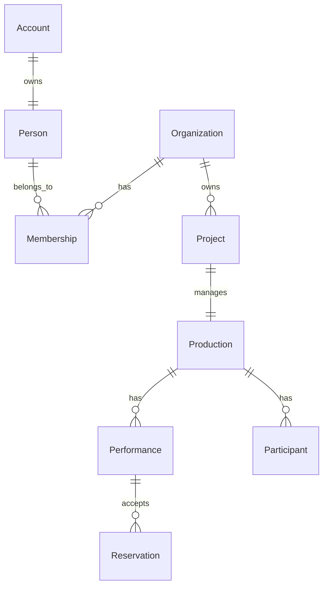

# StageArt Blueprint
# Conceptual ER Diagram

Version : 1.0

---

## Purpose

Conceptual ER Diagramは、StageArtを構成する主要ドメイン同士の関係を表現する。

実装やデータベースではなく、ビジネス上の概念モデルを示す。

---

---

## Notes

- Accountは認証のみを担当する。
- Personは人物を表す。
- Organizationは舞台芸術団体を表す。
- Membershipは所属を表す。
- Projectは制作活動を管理する。
- Productionは公開される公演を表す。
- Performanceは公演回を表す。
- Reservationは予約を表す。
- Participantは出演・スタッフなど公演参加を表す。
