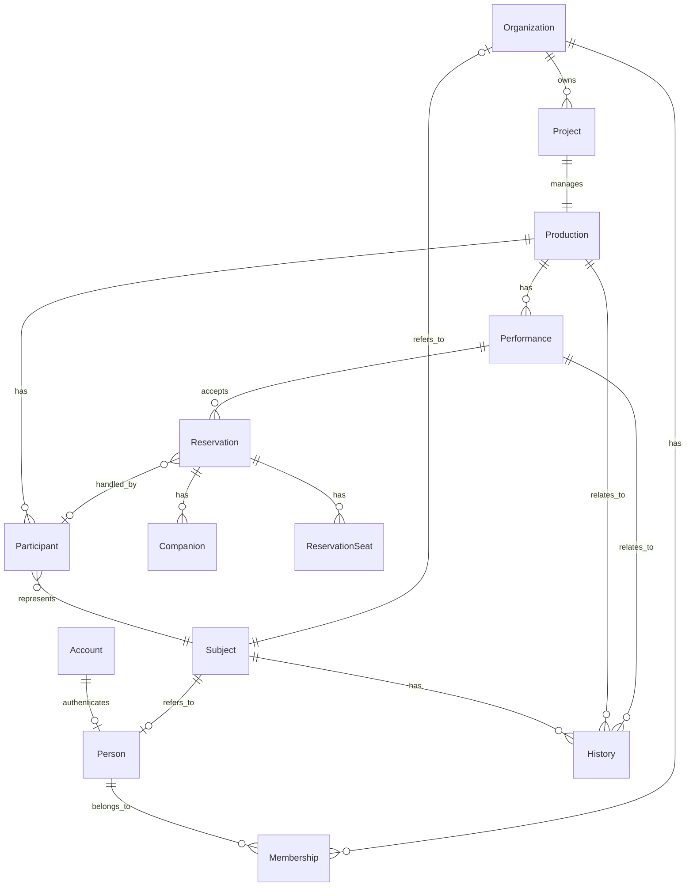

# StageArt Blueprint
# Conceptual ER Diagram

Version : 2.0

---

# Purpose

Conceptual ER Diagramは、StageArtを構成する主要なDomain同士の関係を表現する。

実装やデータベース構造ではなく、
Business上の概念と関係性を示す。

---

# Conceptual Model



---

# Relationship Definitions

## Account - Person

```text
Account
    ↓
Person
```

Accountは認証情報を表す。

PersonはBusiness上の人物を表す。

AccountとPersonは独立した概念であり、
Accountは認証用途、
PersonはBusiness用途で利用する。

---

## Person - Membership - Organization

```text
Person
    │
    ▼
Membership
    ▲
    │
Organization
```

MembershipはPersonとOrganizationの所属関係を表す。

PersonとOrganizationはMembershipを介して関連付けられる。

---

## Organization - Project

```text
Organization
    │
    ▼
Project
```

Organizationは複数のProjectを管理できる。

Projectは制作活動を管理するInternal Domainである。

---

## Project - Production

```text
Project
    │
    ▼
Production
```

ProjectはProductionの制作活動を管理する。

Productionは利用者・観客へ公開されるBusiness Resourceである。

Projectは公開APIには出さない。

---

## Production - Performance

```text
Production
    │
    ├── Performance
    ├── Performance
    └── Performance
```

一つのProductionは複数のPerformanceを持つ。

Performanceは実際の公演回を表す。

---

## Production - Participant

```text
Production
    │
    ├── Participant
    ├── Participant
    └── Participant
```

一つのProductionは複数のParticipantを持つ。

ParticipantはProductionへの参加を表す。

---

## Participant - Subject

```text
Participant
      │
      ▼
   Subject
```

Participantは活動主体を直接PersonまたはOrganizationとして保持しない。

Subjectを介して活動主体を参照する。

Subjectは以下を表現できる。

```text
Subject
   ├── Person
   └── Organization
```

これにより、PersonとOrganizationの双方を
同じParticipant構造で扱う。

---

## Performance - Reservation

```text
Performance
    │
    ├── Reservation
    ├── Reservation
    └── Reservation
```

一つのPerformanceは複数のReservationを受け付ける。

ReservationはPerformanceに対する予約を表す。

---

## Reservation - HandledParticipant

```text
Reservation
      │
      ▼
HandledParticipant
      │
      ▼
 Participant
```

Reservationは任意でHandledParticipantを持つ。

HandledParticipantは、
その予約における「扱い」のParticipantを表す。

いわゆる「○○扱い」の予約を表現する。

HandledParticipantが指定されない予約も存在する。

HandledParticipantはReservationとParticipantの
Business上の関係を表現するものであり、
独立したDomain Entityではない。

---

## Reservation - Companion

```text
Reservation
    │
    ├── Companion
    ├── Companion
    └── Companion
```

一つのReservationは複数のCompanionを持つことができる。

Companionは同行者を表す。

CompanionはReservationに属する子Entityであり、
単独では存在しない。

---

## Reservation - ReservationSeat

```text
Reservation
    │
    ├── ReservationSeat
    ├── ReservationSeat
    └── ReservationSeat
```

ReservationSeatはReservationに属する。

ReservationSeatは予約された座席を表す。

---

## Subject - History

```text
Subject
    │
    ├── History
    ├── History
    └── History
```

Subjectは複数のHistoryを持つ。

HistoryはSubjectがStageArt上で行った活動を記録する。

HistoryはPersonやOrganizationの子Entityではなく、
独立したDomainとして管理する。

---

## History - Production

```text
History
    │
    ▼
Production
```

Historyは必ず一つのProductionに関連する。

Productionによって、
どの公演・作品に関する活動だったかを識別する。

---

## History - Performance

```text
History
    │
    ▼
Performance
```

Historyは必要に応じてPerformanceに関連する。

Production単位の活動ではPerformanceを持たない。

特定の公演回に紐付く活動ではPerformanceを持つ。

---

# History Concept

Historyには以下の活動が含まれる。

```text
History
   │
   ├── PARTICIPATION
   │       └── ParticipantType
   │
   └── AUDIENCE
```

### PARTICIPATION

ParticipantによるProductionへの参加を表す。

ParticipantTypeによって参加区分を表現する。

### AUDIENCE

観客としてPerformanceを観覧した事実を表す。

---

# Domain Boundaries

Conceptual ERでは、
Domain間のBusiness上の関係のみを表現する。

以下の関係は特に重要である。

```text
Participant
    ↓
Subject
```

```text
Reservation
    ↓
HandledParticipant
    ↓
Participant
```

```text
Subject
    ↓
History
```

HistoryはParticipantやReservationの子Entityではない。

HistoryはDomain Eventを契機として独立して生成・更新される。

---

# Design Principles

- Conceptual ERはBusiness上の関係を表現する。
- Databaseの物理構造は表現しない。
- Foreign KeyはLogical ERで定義する。
- ParticipantはSubjectを介して活動主体を参照する。
- SubjectはPersonまたはOrganizationを表す。
- Reservationは任意のHandledParticipantを持つ。
- HandledParticipantはReservationとParticipantのBusiness上の関係を表す。
- CompanionはReservationに属する。
- ReservationSeatはReservationに属する。
- Historyは独立したDomainである。
- HistoryはSubjectを介してPersonまたはOrganizationと関連する。
- HistoryはProductionを必ず参照する。
- PerformanceはHistoryに対して任意である。