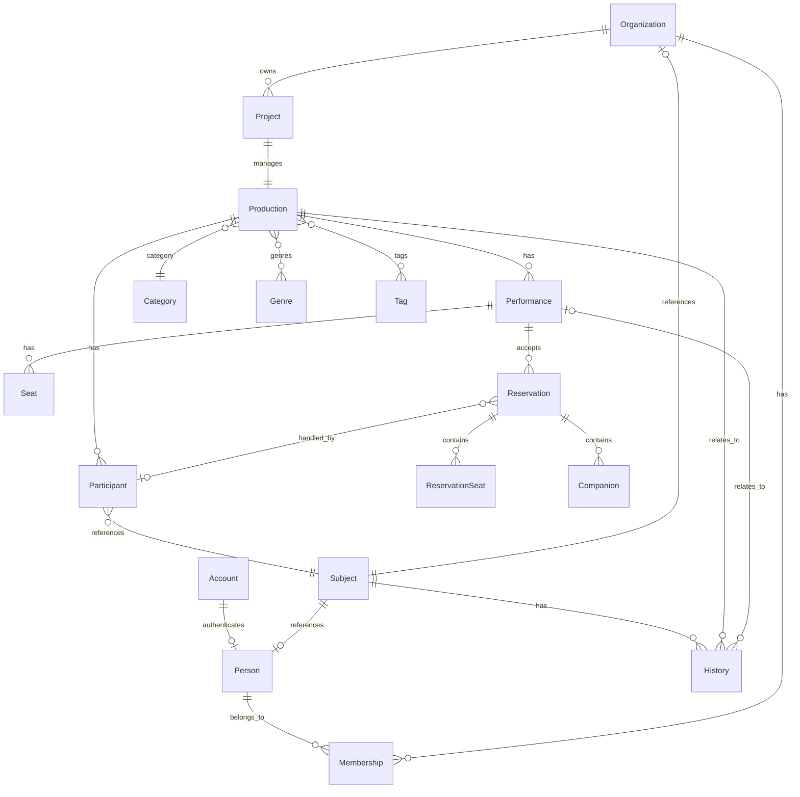

# StageArt Blueprint
# Logical ER Diagram

Version : 2.0

---

# Purpose

Logical ER Diagramは、StageArtの各Domainおよび関連Entityの
論理構造と関係を表現する。

Conceptual ERで定義したBusiness上の関係を、
EntityおよびReferenceとして具体化する。

Database製品固有の型やインデックスなどの物理設計は、
Physical ERまたは実装設計で定義する。

---

# Logical Model



---

# Entity Definitions

## Account

Accountは認証情報を表す。

主な識別子

```text
AccountId
```

AccountはPersonとは独立した概念として管理する。

---

## Person

PersonはStageArtにおける人物を表す。

主な識別子

```text
PersonId
```

Accountとの紐付けは任意とする。

---

## Organization

Organizationは劇団、制作会社、企業などの団体を表す。

主な識別子

```text
OrganizationId
```

---

## Membership

MembershipはPersonとOrganizationの所属関係を表す。

主な参照

```text
PersonId
OrganizationId
```

---

## Project

ProjectはOrganizationが管理する制作プロジェクトを表す。

主な識別子

```text
ProjectId
OrganizationId
```

ProjectはInternal Domainであり、
公開APIには直接公開しない。

---

## Production

Productionは公開される公演を表す。

主な識別子

```text
ProductionId
OrganizationId
ProjectId
```

ProductionはProjectによって内部的に管理される。

---

## Performance

PerformanceはProductionに属する公演回を表す。

主な識別子

```text
PerformanceId
ProductionId
```

---

## Participant

ParticipantはProductionへの参加を表す。

主な識別子

```text
ParticipantId
ProductionId
SubjectId
```

ParticipantはPersonまたはOrganizationを直接参照しない。

`SubjectId`を介して活動主体を参照する。

Participantは以下の情報を持つ。

```text
ParticipantId
ProductionId
SubjectId
ParticipantType
Role
CreditOrder
Visibility
Status
```

---

## Subject

SubjectはBusiness上の活動主体を共通Referenceとして表現する。

主な識別情報

```text
SubjectType
SubjectId
```

SubjectType

```text
PERSON
ORGANIZATION
```

SubjectはPersonまたはOrganizationを表す。

Subjectは独立したBusiness Entityではなく、
PersonおよびOrganizationを共通の参照形式で扱うための概念である。

---

## Seat

SeatはPerformanceに属する座席を表す。

主な識別子

```text
SeatId
PerformanceId
```

---

## Reservation

ReservationはPerformanceに対する予約を表す。

主な識別子

```text
ReservationId
PerformanceId
BookerId
HandledParticipantId
```

Reservationは以下を管理する。

```text
ReservationId
PerformanceId
BookerId
HandledParticipantId
TicketType
QRCode
Status
```

`BookerId`は予約者であるPersonを参照する。

`HandledParticipantId`は予約を担当するParticipantを参照する。

HandledParticipantIdは任意である。

---

## ReservationSeat

ReservationSeatはReservationに紐付く予約座席を表す。

主な識別子

```text
ReservationSeatId
ReservationId
SeatId
```

ReservationSeatはReservationの子Entityである。

---

## Companion

CompanionはReservationに属する同行者を表す。

主な識別子

```text
CompanionId
ReservationId
```

CompanionはReservationの子Entityである。

Companion単独では存在しない。

---

## History

HistoryはSubjectの活動履歴を表す。

主な識別子

```text
HistoryId
SubjectId
ProductionId
PerformanceId
```

Historyは以下の情報を持つ。

```text
HistoryId
SubjectId
HistoryType
ParticipantType
ProductionId
PerformanceId
EventDateTime
```

`PerformanceId`は任意である。

`ParticipantType`はHistoryTypeがPARTICIPATIONの場合のみ保持する。

---

# Reference Rules

## Participant → Subject

Participantは必ず一つのSubjectを参照する。

```text
Participant.SubjectId
    ↓
Subject.SubjectId
```

ParticipantからPersonまたはOrganizationを直接参照しない。

---

## Reservation → Booker

Reservationは必ず一つのBookerを持つ。

```text
Reservation.BookerId
    ↓
Person.PersonId
```

---

## Reservation → HandledParticipant

Reservationは任意でHandledParticipantを持つ。

```text
Reservation.HandledParticipantId
    ↓
Participant.ParticipantId
```

HandledParticipantが存在しないReservationも許可する。

HandledParticipantはReservationとParticipantの関係を表す。

---

## History → Subject

Historyは必ず一つのSubjectを参照する。

```text
History.SubjectId
    ↓
Subject.SubjectId
```

HistoryからPersonまたはOrganizationを直接参照しない。

---

## History → Production

Historyは必ず一つのProductionを参照する。

```text
History.ProductionId
    ↓
Production.ProductionId
```

---

## History → Performance

Historyは必要に応じてPerformanceを参照する。

```text
History.PerformanceId
    ↓
Performance.PerformanceId
```

PerformanceIdはNULLを許可する。

---

# History Rules

HistoryTypeは以下を使用する。

```text
PARTICIPATION
AUDIENCE
```

---

## PARTICIPATION

Productionへの参加履歴を表す。

Participantによって生成される。

```text
Participant
    ↓
ParticipantAdded
    ↓
History
```

ParticipantTypeを保持する。

---

## AUDIENCE

観客としてPerformanceを観覧した履歴を表す。

ReservationCheckedInによって生成される。

```text
Reservation
    ↓
ReservationCheckedIn
    ↓
History
```

ParticipantTypeは保持しない。

---

# Aggregate Structure

```text
Organization
└── Project
    └── Production
        ├── Participant
        └── Performance
            ├── Seat
            └── Reservation
                ├── ReservationSeat
                └── Companion
```

Historyは上記Aggregateの子Entityではない。

```text
Subject
└── History
```

Historyは独立したDomainとして管理する。

---

# Aggregate Root

Aggregate | Root
--- | ---
Organization | Organization
Project | Project
Production | Production
Performance | Performance
Reservation | Reservation

---

# Aggregate Rules

Reservationは以下の子Entityを管理する。

- ReservationSeat
- Companion

これらはReservationを経由してのみ変更できる。

ParticipantはProductionに属する独立したDomain Entityである。

Historyは独立したDomainであり、
ParticipantやReservationのAggregateには含めない。

---

# Domain Event Relationship

HistoryはDomain Eventを契機として生成・更新される。

```text
ParticipantAdded
        ↓
Participation History
```

```text
ParticipantUpdated
        ↓
必要に応じてHistory更新
```

```text
ParticipantRemoved
        ↓
過去のHistoryは削除しない
```

```text
ReservationCheckedIn
        ↓
Audience History
```

以下のイベントではAudience Historyを生成しない。

```text
ReservationCreated
ReservationCancelled
```

---

# Design Principles

- Logical ERはDomain Modelをデータ構造として表現する。
- ParticipantはSubjectを介して活動主体を参照する。
- PersonとOrganizationはSubjectによって共通化して参照する。
- ReservationはHandledParticipantを任意で参照できる。
- HandledParticipantはParticipantを参照する。
- CompanionはReservationの子Entityである。
- ReservationSeatはReservationの子Entityである。
- Historyは独立したDomainである。
- HistoryはSubjectを介して活動主体を参照する。
- HistoryはProductionを必ず参照する。
- PerformanceはHistoryに対して任意である。
- PARTICIPATION HistoryはParticipantTypeを保持する。
- AUDIENCE HistoryはParticipantTypeを保持しない。
- HistoryはDomain Eventを契機として生成・更新する。
- Database製品固有の物理設計はLogical ERでは定義しない。