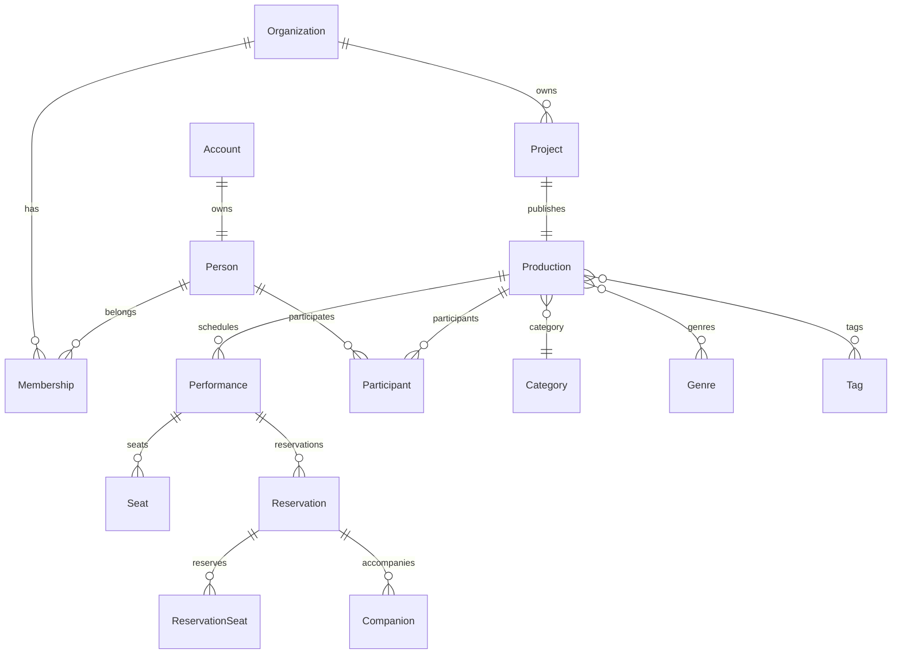

# StageArt Blueprint
# Logical ER Diagram

Version : 1.0

---

## Purpose

Logical ER Diagramは、各ドメインおよび関連エンティティの論理構造を表す。

---



---

## Aggregate

```
Organization

└── Project

    └── Production

        ├── Participant

        ├── Performance

        │   ├── Seat

        │   └── Reservation

        │       ├── ReservationSeat

        │       └── Companion

        ├── Category

        ├── Genre

        └── Tag
```

---

## Aggregate Root

| Aggregate | Root |
|-----------|------|
| Organization | Organization |
| Project | Project |
| Production | Production |
| Performance | Performance |
| Reservation | Reservation |

Reservationは以下の子エンティティを管理する。

- ReservationSeat
- Companion

これらはReservationを経由してのみ変更できる。
